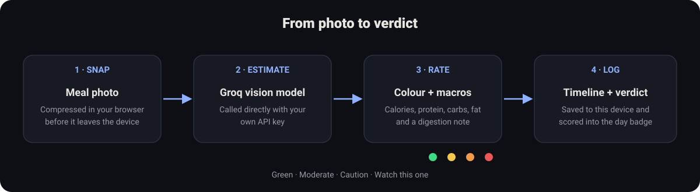
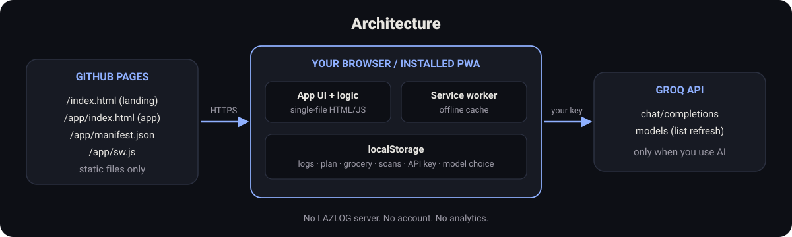

<p align="center"></p>

# LAZLOG

A private, local-first diet and habit tracker. Tap to log coffee, water, smokes, junk food, weight and mood. Snap a meal for instant nutrition. Get an honest verdict on your day. Your data stays on your device.

**Live:** https://johnlaz.github.io/lazlog/  
**App:** https://johnlaz.github.io/lazlog/app/

## What it does

- **Quick Tap logging** for coffee, water, smokes and junk food, with a daily count.
- **Daily verdict** (WIN, MIXED, SLIPPING, SCREWUP) and a seven-day trend strip.
- **Snap a Meal:** photo to calories, macros, a colour rating and a digestion note.
- **Ask My Chef:** a conversation to refine a meal idea, with healthier swaps.
- **Meal Plan:** a day of realistic meals from what you have on hand, with a shopping list you can send to Grocery.
- **Quick Scan:** photograph a shelf item for a quick colour rating (last 20 saved).
- **Weight and feeling** tracking with a sparkline.
- **Backup:** one-tap Back Up and Restore (a JSON file, safe to restore more than once), plus copy-as-text.

<p align="center"></p>

## Repo layout

```
/index.html            landing page
/README.md
/docs/                 README visuals (SVG)
/app/index.html        the app (single file)
/app/manifest.json     PWA manifest (scope /lazlog/app/)
/app/sw.js             service worker
/app/icon-192.png
/app/icon-512.png
/app/shot-narrow-1.png, shot-narrow-2.png, shot-wide-1.png
```

<p align="center"></p>

## AI and model setup

AI features use [Groq](https://console.groq.com/keys) with **your own free API key**. Open **Settings**, paste the key and tap **Save Key**.

- The model list loads automatically when you save a key. Tap **Refresh model list** at any time.
- Two pickers: one for the chef and meal plan, one for photos (the photo model must accept images).
- The default is `qwen/qwen3.6-27b`. Your choice is never changed automatically. If a saved model disappears from Groq's list it stays selected and is flagged.
- If a model rejects the reasoning or JSON-mode parameters, LAZLOG retries once without them.

## Data and privacy

- Everything is stored in your browser's `localStorage`. There is no LAZLOG server, no account and no analytics.
- Your API key stays on the device and is never included in backups.
- A photo, or text you type into Ask My Chef or Meal Plan, is sent to Groq **only when you use that feature**, directly from your browser with your key. Review Groq's own terms for how they handle requests.
- Clearing site data erases your logs. Back up first (Settings, Backup).
- Calorie and macro figures are AI estimates for awareness, not medical or dietary advice.

## Deploy and update

Hosted on GitHub Pages from the repository root.

1. Commit the files above to `main`.
2. In the repo, Settings, Pages: deploy from `main`, folder `/ (root)`.
3. **To ship an update:** bump `APP_VERSION` in `app/index.html` **and** `VERSION` in `app/sw.js` to the same value. The new service worker installs, and open copies show a "new version ready" bar with a Reload button.

## Changelog

### 1.0.1
- New app icon (shutter-and-plate mark), used in the header, landing page and README.

### 1.0.0
- Split into landing page (root) and app (`/app`).
- Installable PWA: manifest, service worker (network-first HTML, cache-first assets), offline support, 192/512 icons, screenshots.
- Fonts are now system fonts, so the app is fully offline-capable with no external requests besides Groq.
- Groq model pickers with refresh on key save; saved selections are never swapped.
- Visible version stamp tied to the service worker cache version.
- New LAZLOG identity: ring mark, SVG icon set, verdict-tinted hero card.
- Accessibility: pinch-zoom enabled, real buttons, labelled inputs, keyboard-operable lists, live toast, larger minimum text, reduced-motion support.
- Simpler Back Up / Restore wording; backup now includes the pantry list.
- User and model text is HTML-escaped before display.
- Removed debug logging of raw model responses.

---
© 2026 LAZLAB Creations. All Rights Reserved. · lazlab.io@gmail.com
